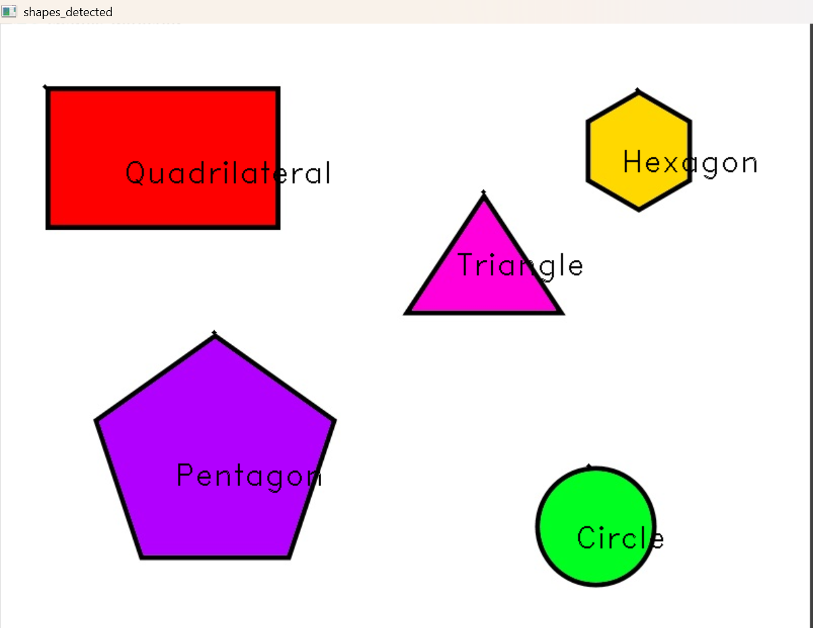

# Shape-Detection
# Table of Contents

- Overview
- Methods
  - Anaconda & VS
  - Python
- Output

---

## Overview

This is Task Two under the AI & Robotics Operating Systems track, submitted to Smart Methods Company for 2025 Summer Internship. This task presents a computer vision model utilizing OpenCV library. The model is capable of detecting various shapes with different cutouts within an image.

---

## Methods

Three different tools were integrated to accomplish the task: Anaconda, Visual Studio (VS), and Python. Each tool serves a distinct purpose, yet they complement one another to ensure smooth execution of the project.

### Anaconda & VS

Anaconda provides the base environment for Visual Studio, including essential libraries such as OpenCV. As a result, no external programs or additional installations, even Python itself, are required, since Anaconda’s base environment supplies everything needed.

### Python

As mentioned earlier, Python is not required as standalone software, but the code is written in Python format (.py). The code is developed and executed in Visual Studio, operating on Anaconda’s base environment. It imports the image path (with the image stored in the same folder), analyzes the number of edges of each shape, and identifies the shape accordingly. Additionally, the code includes variables that are used to display text annotations on the final processed image.

> **Note:** The code is attached as separate file in the repository.

---

## Output

<b>Figure 1: Result</b>

As shown in Figure 1, five shapes were successfully detected. The program identifies each shape by analyzing its edges and cutouts. For example, if a shape has five edges, it is classified as a Pentagon.

---
